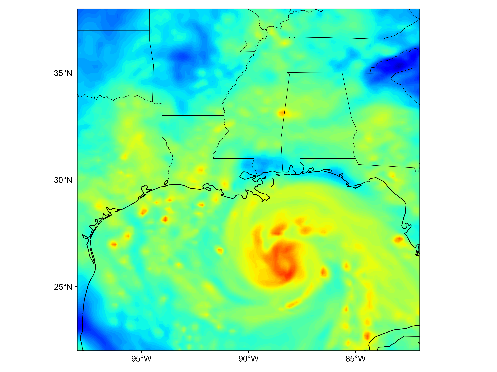
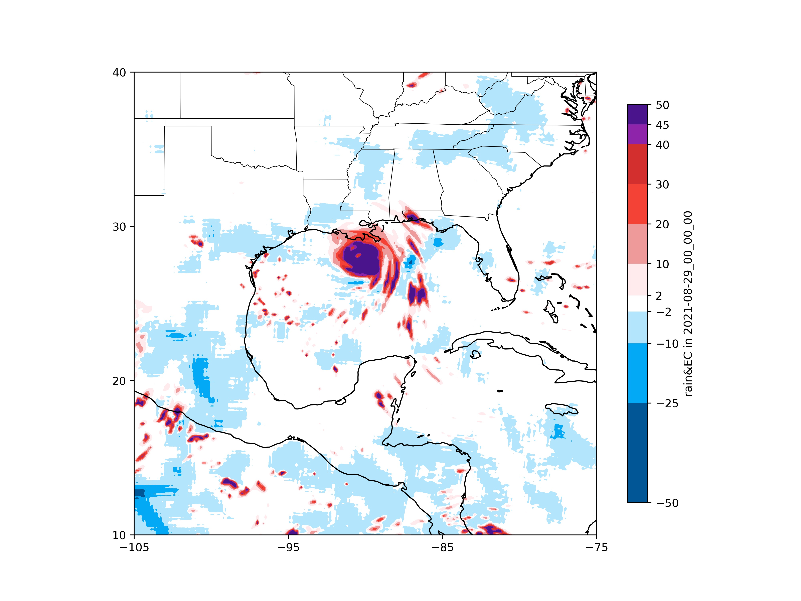

# WRFPostProcess
WRF模式后处理

## 与ECMWF真实值进行比较

## WRF降水评分

## WRF Geographing
Some scripts which can draw indicators from wrfout files

Fig.1 Cloud Top Temp(first line), vertical wind speed (second line), vertical temperature (third line)

Fig.2 Precipitation Water Vapor from wrfout file

Fig.3 3h accumulated Precipitation against ERA5 reanalysis