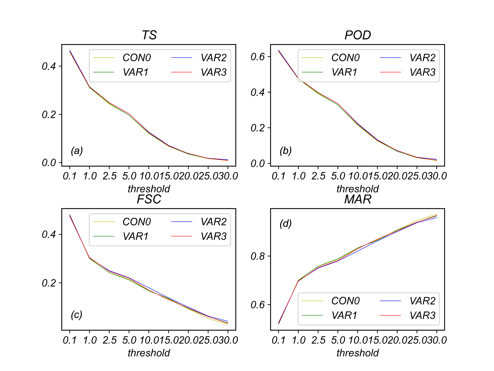

# WRFPostProcess

## WRF Precipitation Scores
Objective verification is carried out to quantitatively evaluate the impact of assimilating multi-obs

Fig.1 some indexs to evaluate the accuracy of prediction of precipitation
## WRF Geographing
Some scripts which can draw indicators from wrfout files

Fig.1 Cloud Top Temp(first line), vertical wind speed (second line), vertical temperature (third line)

Fig.2 Precipitation Water Vapor from wrfout file

Fig.3 3h accumulated Precipitation against ERA5 reanalysis
